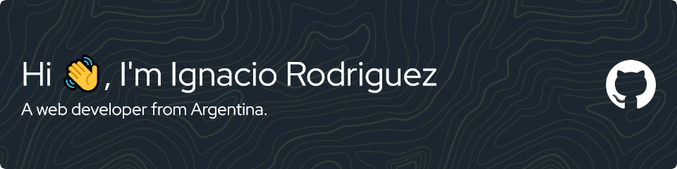

<a href="https://visitcount.itsvg.in" target="blank">

</a>

## **A little about me...**

#### 🔌 I'm an electronics technician.  👀 I’m interested in Backend Development, AI, DevOps, Arduino, Computer Networking, and coding in general.  🌱 I’m currently learning various web technologies, while i work on the field.  📠My future techs to learn are ~~PostgreSQL~~, ~~Redis~~, ~~GraphQL~~, ~~Docker~~ & ~~Kubernetes~~, ~~Nginx~~ (looking for more 👀), and another language like Go or Java.  ğŸ’ï¸ I’m looking to collaborate on tech companies looking for devs open to let their knowledge grow along the way.

 

<!-- Inline CSS not supported... -->

<h2 style="margin-bottom:15px">Socials</h2>

<h2>Portfolio</h2>

 
 

# 💻 Main Tech Stack

 

 

 

 

# 📈 My Stats
 
  
<!--   -->
---

 

<!-- 
Created with:
    -GPRM ( https://gprm.itsvg.in )
    -Github Profile Header Generator (https://leviarista.github.io/github-profile-header-generator/) 
-->
